[TOC]

R语言学习教程

参考网址：https://www.runoob.com/r/r-tutorial.html

# R语言安装

## 一、环境配置

安装包网址：https://cran.r-project.org/

下载4.0.4版本

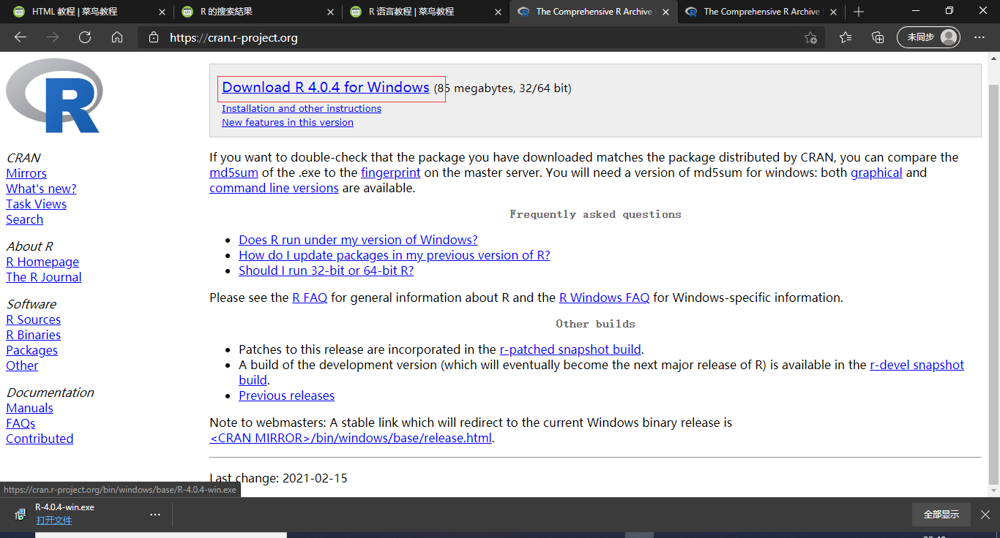

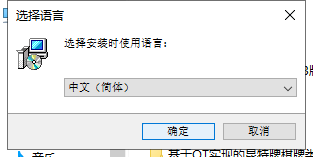

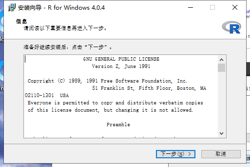

更改存储位置（可以将C直接改为D，就会放在D盘下了）

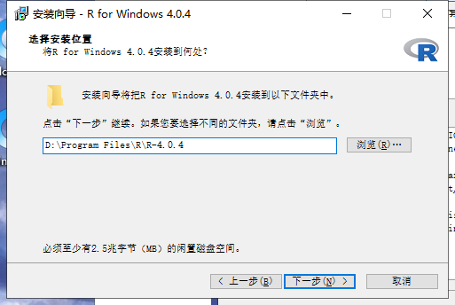

之后的安装内容可以全部勾选，也可以只要核心文件和64为的文件（尽量直接全安装）

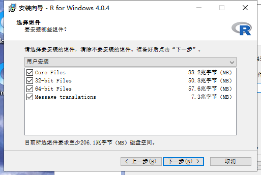

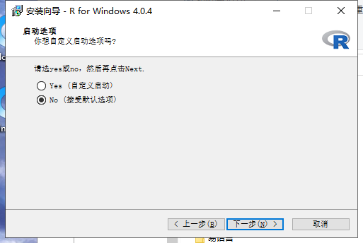

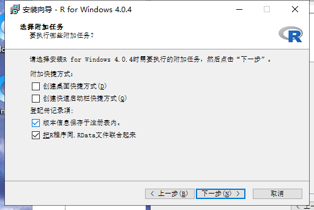

之后等待安装完成就可以了

## 二、配置环境变量

右击此电脑，点击属性打开属性面板，点击左侧高级系统设置，之后点击环境变量，进入后双击系统变量下的path，之后点击新建，输入刚刚的安装路径加\bin（即D:\Program Files\R\R-4.0.4\bin），之后点击确定，再点击确定

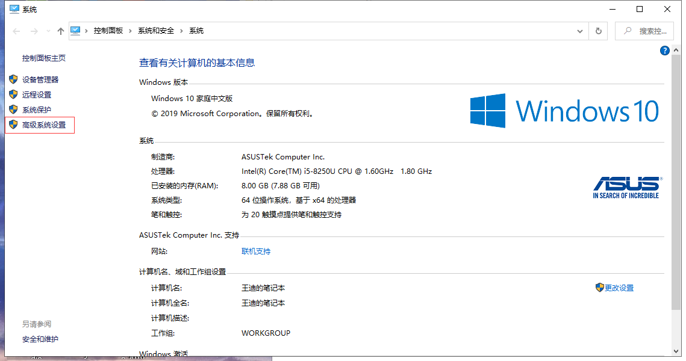

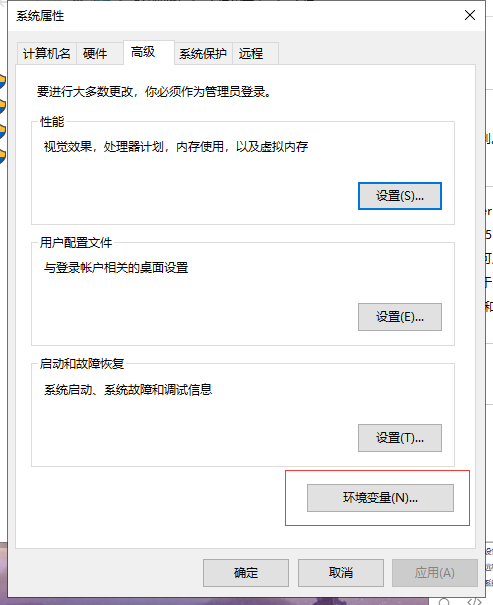

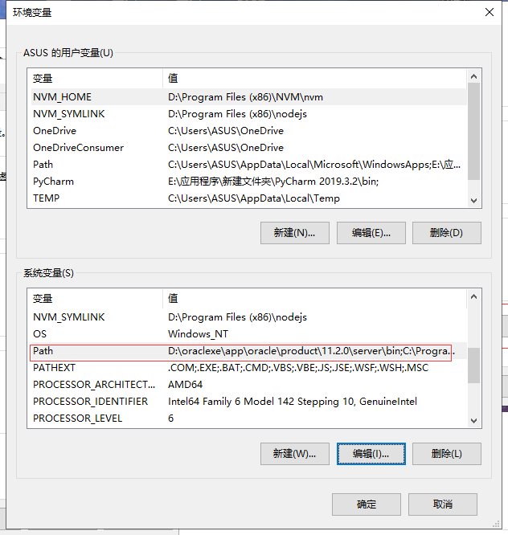

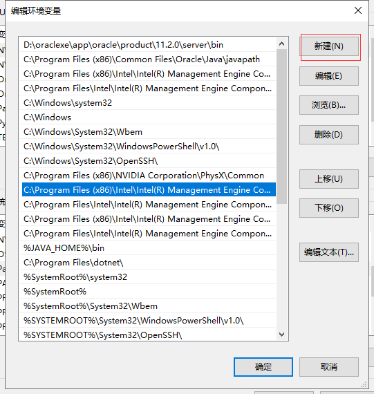

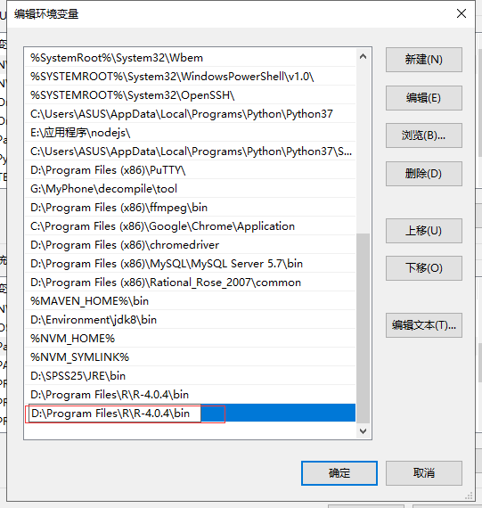

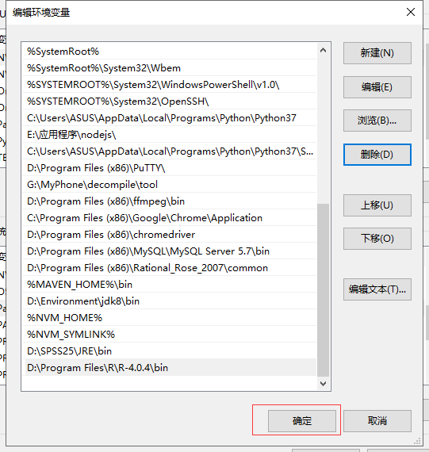

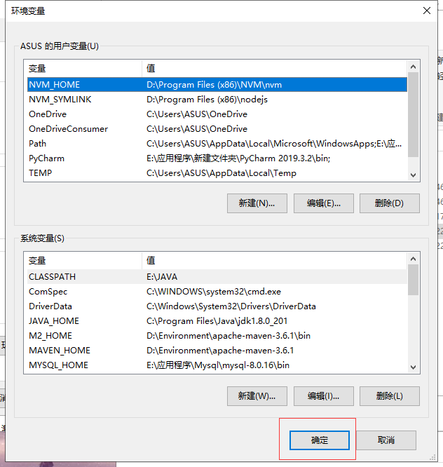

## 三、进入R交互界面

在桌面底部输入栏输入CMD，打开命令提示行，输入R，即可进入交互程序

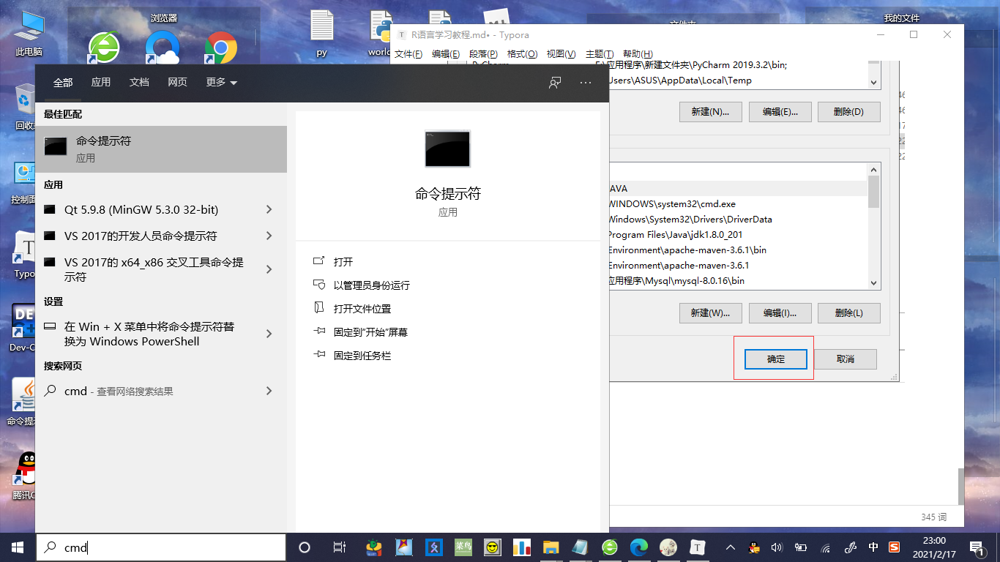

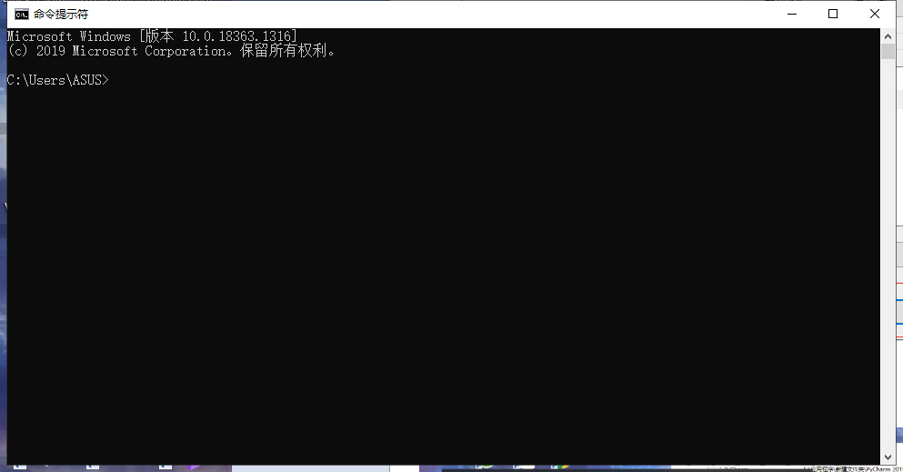

# R语言语法学习

## 一、基础语法

### 1 变量名命名规则

 字母或点开头，包括字母数字和点以及下划线（C、Java、python等语言不可以包括点也不能以点开头，所有编程语言通用的规则是字母开头，包含字母、数字和下划线）hel.kk

### 2 注释

通过#添加注释，#之后的内容为注释内容（python中同样通过#进行注释）

```python
'''
jjjj
jjjj
'''
#jjjj
print()
```

### 3 数据类型

字符串>浮点型>数字>逻辑

**数字** 常用的整数和小数，也可以用科学计数法表示，与其他语言一致

```R
a = 1.25e2#e前为小数e后为指数
print(a)#[1] 125
```

**逻辑**  TRUE、T（真） 和 FALSE、F（假）

**文本or字符串** 可以用双引号也可以用单引号，值得注意的是在R语言中无法通过数组的方式获取字符串中的某些字符，但是R中提供了substring这个内置函数来实现这一功能

```R
a = "hello world!"
print(substring(a,1,5))#[1] "hello"
paste(..., sep = " ", collapse = NULL)#用于使用指定对分隔符来对字符串进行连接，默认对分隔符为空格
format(x, digits, nsmall, scientific, width, justify = c("left", "right", "centre", "none")) #用于格式化字符串，format() 可作用于字符串或数字
```

```R
#字符串操作函数
toupper("Runoob") # 转换为大写
tolower("Runoob") # 转换为小写
nchar("中文", type="bytes") # 统计字节长度
nchar("中文", type="char") # 总计字符数量
substr("123456789", 1, 5) # 截取字符串，从 1 到 5
substring("1234567890", 5) # 截取字符串，从 5 到结束
as.numeric("12") # 将字符串转换为数字
as.character(12.34) # 将数字转换为字符串
strsplit("2019;10;1", ";") # 分隔符拆分字符串
gsub("/", "-", "2019/10/1") # 替换字符串
```


### 4 基础操作

**赋值**<-、<<-、->>、->和=，赋值变量名在箭头指的一边，我们一般用=就可以（C、Java、Python等语言也使用=进行赋值，赋值变量在前，内容在后）

```R
# 使用等号 = 号赋值
> var.1 = c(0,1,2,3)          
> print(var.1)
[1] 0 1 2 3

# 使用左箭头 <-赋值//
> var.2 <- c("learn","R")  
> print(var.2)
[1] "learn" "R"
   
# 使用右箭头 <- 赋值
> c(TRUE,1) -> var.3
> print(var.3)
[1] 1 1   
```

### 5 运算符

#### 数学运算符

| 优先级 | 符号 |   含义   |
| :----- | :--- | :------: |
| 1      | ()   |   括号   |
| 2      | ^    | 乘方运算 |
| 3      | %%   | 整除求余 |
|        | %/%  |   整除   |
| 4      | *    |   乘法   |
|        | /    |   除法   |
| 5      | +    |   加法   |
|        | -    |   减法   |

计算的规则：将短的对象整数倍扩充成最长的对象

#### 关系运算符

关系运算符与C、Java、Python等都不一致。判断向量的每个元素，并输出，即有四个元素就输出四个结果

**判等**==相等  !=不等 

**比较**>大于 <小于 >=大于等于 <=小于等于

#### 逻辑运算符

与C、Java等语言不同

&为元素逻辑与，判断两个向量的对应每一个元素是否是否都为真（同理|为元素逻辑或）

&&为逻辑与，判断两个向量的第一个元素是否都为真（同理||为逻辑或）

！为逻辑非，将向量每个元素都取反

#### 其他运算符

| 运算符 | 描述                                                         |
| :----- | :----------------------------------------------------------- |
| :      | 冒号运算符，用于创建一系列数字的向量。                       |
| %in%   | 用于判断元素是否在向量里，返回布尔值，有的话返回 TRUE，没有返回 FALSE。判断时，数据将默认进行类型转换，转换成相同数据类型再进行比较。 |
| %*%    | 用于矩阵乘法运算。                                           |

### 6 条件判断

**if...else...**进行条件判断通过判断if后的条件决定是否执行内容，如果if中的条件为假则执行else中的内容，也可以没有else，即只在if的条件为真时执行内容

**else if**相当于嵌套使用

```R
if(){
    
}else if(){#elif
    
}else{
    
}
#等价于 
if(){
    
}else { 
    if() {}else{} 
}
```

**switch**通过不同的值选择不同的输出（与其他语言不同的是，R语言通过内置函数的方式实现的映射，并且无法像C和Java一样执行语句段，值得注意的是python中并没有switch..case的用法，因为python中包含了字典这一映射方式）

```C
switch(){
	case 10:
        printf("111");
    default:
        break;
}
```

```R
switch(
   3,
   "google",
   "runoob",
   "taobao",
   "weibo"
)
```

```python
a ={"x":222,"y":111,"z":"jjjj"}#python 中的字典
print(a["x"])
print(a["z"])
```

### 7 循环

**break**循环结束命令，执行break就立即跳出循环（与C、Java、Python等语言一致）

**repeat死循环**通过break跳出循环

```R
repeat { 
    // 相关代码 
    if(condition) {
       break
    }
}
```

**while条件循环**条件不成立时结束循环（也可以通过break跳出循环）

```R
while() {
   print(v)
   cnt <- cnt+1
   
   if(cnt > 5) {
      break
   }
}
a = c(1,2,3)
for(ai in a){
    print(ai)
}
```

**for变量循环**变量遍历完后结束循环（也可以通过break跳出循环）

**next**类似于C、Java、Python等语言的continue，执行到continue就立即执行下一次循环

### 8 特殊标识符

NA：占位符

NULL：空，无意义

## 二、内置函数

**mode()** 获取数据类型

函数返回值的问题：可以通过return()显式返回，否则就会默认把函数体的最后一个表达式作为返回值返回。

### 1  向量

**c()**是最常用的一个内置函数，就是用来创建一个向量的函数，同样也可以用**seq()**来生成等差数列（该函数包括数列的起始位置，结束位置和长度三个参数），同样也可以用 **: **这个运算符生成连续数字的向量。可以通过**names()**这个函数来为向量的元素命名，也可以通过**索引**或**名称**来访问向量的元素

| **函数名** | **含义**                             |
| :--------- | :----------------------------------- |
| sum        | 求和                                 |
| mean       | 求平均值                             |
| var        | 方差                                 |
| sd         | 标准差                               |
| min        | 最小值                               |
| max        | 最大值                               |
| range      | 取值范围（二维向量，最大值和最小值） |

### 2  数组

**array()**为构造数组的函数

```R
array(data = NA, dim = length(data), dimnames = NULL)
#data 向量类型，数组的所有元素
#dim 数组的维度，默认是一维数组
#dimnames 维度的名称，必须是列表类型，默认情况下为空
#不可以通过names更改数组的纬度名称
```

可以通过**索引**或**名称**来访问数组的元素

**apply()** 元素对数组元素进行跨维度计算,主要是同过传入的函数对数组进行变换，margin即为需要保留的维度

```R
apply(x, margin, fun)
#x 数组
#margin 数据名称
#fun 计算函数
```

### 3  列表

**list()**为构造列表的函数，可以包括字符串、数字、向量、矩阵、列表等数据类型，并且可以混合使用，可以通过**索引**的方式来进行访问，也可以通过**列表变量名+$+元素名称**的方式来访问，可以用**c()**来合并列表，通过**unlist()**来将列表转换为向量进行计算，通过**列表变量名+$+元素名称**的方式可以直接对元素进行操作，不需要**unlist()**

```R
#结尾插入数据
append(x, values, after = length(x))
```


### 4  矩阵

**matrix()**是用来生成矩阵的函数

```R
matrix(data = NA, nrow = 1, ncol = 1, byrow = FALSE,dimnames = NULL)
#data为构造矩阵的向量
#nrow为矩阵的行数
#ncol为矩阵的列数
#byrow为是否按列构造，默认按行构造
#dimnames为行列的名字，需要包含两个向量的列表
```

**clonames()**为设置矩阵的列名称

**rownames()**为设置矩阵的行名称

**%*%**为计算矩阵与其转置矩阵的乘法符号

**t()**为转置矩阵的函数

**solve()**为计算矩阵的逆的函数

访问矩阵的元素可以通过一维或二维**索引**的方式也可以使用**行列名称**来定位，而行缺省显示整列，列缺省显示整行

```R
# 定义行和列的名称
rownames = c("row1", "row2", "row3", "row4")
colnames = c("col1", "col2", "col3")

# 创建矩阵
P <- matrix(c(3:14), nrow = 4, byrow = TRUE, dimnames = list(rownames, colnames))
print(P[1,1])
print(P["row1","col1"])
```

**+ - * / **可以直接用来进行矩阵对应位置元素的运算

**apply()** 函数可以将矩阵的每一行或每一列当作向量来进行操作

### 5  因子

```R
#生成因子
factor(x = character(), levels, labels = levels,
       exclude = NA, ordered = is.ordered(x), nmax = NA)
#x：向量。
#levels：指定各水平值, 不指定时由x的不同值来求得。
#labels：水平的标签, 不指定时用各水平值的对应字符串。
#exclude：排除的字符。
#ordered：逻辑值，用于指定水平是否有序。
#nmax：水平的上限数量。

#生成因子水平
gl(n, k, length = n*k, labels = seq_len(n), ordered = FALSE)
```

### 6  数学函数

| 函数     | 说明                            |
| :------- | :------------------------------ |
| sqrt(n)  | n的平方根                       |
| exp(n)   | 自然常数e的n次方                |
| log(m,n) | m的对数函数，返回n的几次方等于m |
| log10(m) | 相当于log(m,10)                 |

| 名称    | 参数模型 | 含义                       |
| :------ | :------- | :------------------------- |
| round   | (n)      | 对 n 四舍五入取整          |
| round   | (n, m)   | 对 n 保留 m 位小数四舍五入 |
| ceiling | (n)      | 对 n 向上取整              |
| floor   | (n)      | 对 n 向下取整              |

| 三角函数 | 说明     |
| :------- | :------- |
| sin()    | 正弦函数 |
| cos()    | 余弦函数 |
| tan()    | 正切函数 |

| 反三角函数 | 说明   |
| :--------- | :----- |
| asin()     | 反正弦 |
| acos()     | 反余弦 |
| atan()     | 反正切 |

| 正态分布函数 | 说明                                    |
| :----------- | :-------------------------------------- |
| dnorm(0)     | 概率密度函数                            |
| pnorm(0)     | 概率密度积分函数（从无限小到 x 的积分） |
| qnorm(0.95)  | 分位数函数                              |
| rnorm(3,5,2) | 随机数函数（常用于概率仿真）            |

### 7  数据框

类似于表格，是一种特殊的二维列表

```R
data.frame(…, row.names = NULL, check.rows = TRUE,
           check.names = TRUE, fix.empty.names = TRUE,
           stringsAsFactors = default.stringsAsFactors())
#...：构建数据框的向量，包括多个
#row.names: 行名，默认为 NULL，可以设置为单个数字、字符串或字符串和数字的向量。
#check.rows: 逻辑值，设置是否检查行的名称和长度是否一致
#check.names: 逻辑值，设置是否检查数据框的变量名是否合法
#fix.empty.names: 逻辑值，设置未命名的参数是否自动添加名字。
#stringsAsFactors: 逻辑值，设置字符是否转换为因子，默认是TRUE

#通过因子构建数据框
f <- factor(rep(c("试验组","对照组"), each=8))
data.frame(x,f)

rep(x, times = 1, length.out = NA, each = 1)
#x：代表的是你要进行复制的对象，可以是一个向量或者是一个因子。
#times：代表的是复制的次数，只能为正数。负数以及NA值都会为错误值。复制是指的是对整个向量进行复制。
#each：代表的是对向量中的每个元素进行复制的次数。
#length.out：代表的是最终输出向量的长度

#按照要求把数据打组聚合
aggregate(x, by, FUN, ..., simplify = TRUE)
#by参数必需是串列，也可以包含多个类型的因子，得到的就是每个不同因子组合的统计结果
aggregate(formula, data, FUN, ..., subset, na.action = na.omit)
aggregate(x, nfrequency = 1, FUN = sum, ndeltat = 1, ts.eps = getOption("ts.eps"), ...)
```

通过**str()**函数获取数据结构简略信息，将数据框的每一列逐行输出

通过**summary()** 函数可以显示数据框的概要信息

**访问数据框的元素**

```R
# 提取指定的列
result = data.frame(table$姓名,table$月薪)
result = table[,1:2]
# 提取指定的行
result = table[1:2,]
```

**添加列**

```R
# 添加一列
table$apartment = c("transition","technology")
```

**添加行**

使用 **rbind()** 函数将两个数据框合并

```R
newtable = data.frame(
    姓名 = c("小明", "小白"),
    工号 = c("101","102"),
    月薪 = c(5000, 7000)
)
# 合并两个数据框
result <- rbind(table,newtable)
```

使用 **cbind()** 函数将多个向量合成一个数据框

```R
# 创建向量
sites <- c("Google","Runoob","Taobao")
likes <- c(222,111,123)
url <- c("www.google.com","www.runoob.com","www.taobao.com")
#cbind创建的数据框是字符型的，通过as.data.frame函数变换后输出格式改变，但是数据元素的类型仍然是字符型
#data.frame创建的数据框与创建所用向量的数据类型一致


# 将向量组合成数据框
addresses <- cbind(sites,likes,url)
```

使用merge()合并数据框

```R
 merge(x, y, by = intersect(names(x), names(y)),
      by.x = by, by.y = by, all = FALSE, all.x = all, all.y = all,
      sort = TRUE, suffixes = c(".x",".y"), no.dups = TRUE,
      incomparables = NULL, …)
#x, y： 数据框
#by, by.x, by.y：指定两个数据框中匹配列名称，默认情况下使用两个数据框中相同列名称。
#all：逻辑值; all = L 是 all.x = L 和 all.y = L 的简写，L 可以是 TRUE 或 FALSE。
#all.x：逻辑值，默认为FALSE。如果为TRUE,显示x中匹配的行，即便y中没有对应匹配的行，y 中没有匹配的行用 NA 来表示。
#all.y：逻辑值，默认为FALSE。如果为TRUE,显示y中匹配的行，即便x中没有对应匹配的行，x 中没有匹配的行用 NA 来表示。
#sort：逻辑值，设置是否对列进行排序
```

**四种连接方式**：自然连接、全连接、左外连接、右外连接

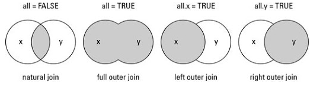

**数据整合和拆分**

```R
melt(data, ..., na.rm = FALSE, value.name = "value")
#data：数据集。
#...：传递给其他方法或来自其他方法的其他参数。
#na.rm：是否删除数据集中的 NA 值。
#value.name 变量名称，用于存储值。

cast(data,formula,fun.aggregate = NULL,...,margins = NULL,subset = NULL,fill = 		NULL,drop = TRUE,value.var = guess_value(data))
#data：合并的数据框。
#formula：重塑的数据的格式，类似 x ~ y 格式，x 为行标签，y 为列标签 。
#fun.aggregate：聚合函数，用于对 value 值进行处理。
#margins：变量名称的向量（可以包含"grand\_col" 和 "grand\_row"），用于计算边距，设置 TURE 计算所有边距。
#subset：对结果进行条件筛选，格式类似 subset = .(variable=="length")。
#drop：是否保留默认值。
#value.var：后面跟要处理的字段。
#格式cast(res1,name~variable)#第二个参数为不变的属性（用‘+’连接）~变化的属性名（作为值的属性不能写）
```

## 三、导入包

### 1 安装包（将包添加到本地）

```R
install.packages("要安装的包名")
.libPaths()#查看 R 包的安装目录
library()#查看已安装的包
```

### 2 引用包

```R
library("包名")
search()#查看编译环境已载入的包
any(grepl("包名",installed.packages()))#查询包是否已安装到本地
```

## 四、输入输出

```R
#键盘输入
readline(prompt = "")#prompt为输入提示
#输出
print(x, ...)
cat(..., file = "", sep = " ", fill = FALSE, labels = NULL, 
  append = FALSE)
sink(file = NULL, append = FALSE, type = c("output", "message"), 
  split = FALSE)#设置输出的文件
```

## 五、文件操作

**csv**

```R
read.csv(file,header=TRUE,sep=",",quote="\"",dec=".",fill=TRUE,comment.char="",...)
write.csv(...)
#"readr"可以解决csv数据追加的问题
install.packages("readr")  
library("readr")	
write_csv( x , path , col_names = TRUE , append = TRUE )
```

**xlsx**

```R
install.packages("xlsx", repos = "https://mirrors.ustc.edu.cn/CRAN/")
any(grepl("xlsx",installed.packages()))
library("xlsx")
read.xlsx(file,sheetIndex,sheetName=NULL,colIndex=NULL,startRow=NULL,
          endRow=NULL,rowIndex=NULL,as.data.frame=TRUE,header=TRUE,
          colClass=NA,keepFormulas=FALSE,encoding="unknown",password=NULL,...)
#是否去掉名字
write.xlsx(x,file,sheetName="Sheet1",col.names=TRUE,row.names=TRUE,append=FALSE			  ,showNA=TRUE,password=NULL)
```

**xml**

```R
install.packages("XML", repos = "https://mirrors.ustc.edu.cn/CRAN/")
any(grepl("XML",installed.packages()))
library("XML")
read.xmlParse(file)
xmlRoot(name)
xmlSize(obj)
xmlToList(node)
xmlToDataFrame(doc)
```

**json**

```R
#install.packages("rjson", repos = "https://mirrors.ustc.edu.cn/CRAN/")
#any(grepl("rjson",installed.packages()))
#library("rjson")
#fromJSON(file)
library("jsonlite")
read_json(path)
write_json(x,path)
#查看数据，某一行使用[ ],指定的行和列使用[[ ]]
#访问数据，读取出来的格式为list
result$<属性名>
# 转为数据框

as.data.frame(x,row.names=TRUE,optional=FALSE,...)

toJSON(x, dataframe = c("rows", "columns", "values"), matrix = c("rowmajor", 
  "columnmajor"), Date = c("ISO8601", "epoch"), POSIXt = c("string", 
  "ISO8601", "epoch", "mongo"), factor = c("string", "integer"), 
  complex = c("string", "list"), raw = c("base64", "hex", 
    "mongo", "int", "js"), null = c("list", "null"), na = c("null", 
    "string"), auto_unbox = FALSE, digits = 4, pretty = FALSE, 
  force = FALSE, ...)
```

**MySQL 连接**

```R
install.packages("RMySQL", repos = "https://mirrors.ustc.edu.cn/CRAN/")
any(grepl("RMySQL",installed.packages()))
library(RMySQL)
dbConnect(MySQL(), user = 'root', password = '', dbname = 'test',host = 'localhost')#连接到数据库
dbListTables(mysqlconnection)#查看数据
dbSendQuery(mysqlconnection, "SQL语句")#数据库操作
fetch(result, n = 2)#获取数据
```

## 六、画图

### 1 语言自带包

使用 png()、jpeg()、bmp() 函数设置输出的文件格式为图片

```R
# 设置输出图片
png(file='runoob-pie.png', height=300, width=300)
```

#### 最基础的画图函数

```R
plot(x, y, type="p", xlim = NULL, ylim = NULL,log = "", main = NULL, sub = NULL, xlab = NULL, ylab = NULL,ann = par("ann"), axes = TRUE, frame.plot = axes,panel.first = NULL, panel.last = NULL, asp = NA, ...)
```

**x**：横坐标 x 轴的数据集合

**y**：纵坐标 y 轴的数据集合

**type**：绘图的类型，p：点图，l：线图，b：同时绘制点和线，c：仅绘制参数 b 所示的线，o：同时绘制点和线，且线穿过点，h：绘制出点到横坐标轴的垂直线，s：阶梯图，先横后纵，S：阶梯图，先纵后竖，n： 空图

**xlim、ylim**：x 轴和 y 轴的范围

**log**：

**main**：图表标题

**sub**：底部标题

**xlab、ylab**：x 轴和 y 轴的标签名称

**ann**：布尔值，是否显示x 轴和 y 轴的标签名称

**axes** 布尔值，是否使用坐标轴，如果为FALSE，则框架和刻度全部没有了

**cex**：

**col**：设定绘图颜色

**frame.plot**：布尔值，是否绘制边框（上、右）

**panel.first**：**grid()**，绘制

**panel.last**：**grid()**

**asp**：限定 *y/x* 类似刻度的比例

**xaxt**="n"  禁用x轴的刻度线

**yaxt**="n"  禁用y轴的刻度线

**pch**：设置观察点的符号，pch一共有25个参数值

0：方点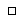

1：圆点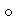

2：三角点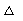

3：十字点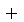

4：×点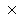

5：菱形点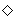

6：倒三角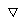

7：×加十字点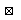

8：米字点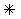

9：菱形加十字点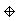

10：圆加十字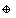

11：六芒星点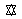

12：田字点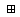

13：炸弹点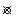

14：方形加倒对勾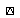

15：实心方块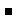

16：实心圆点

17：实心三角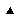

18：实心菱形

19：实心圆角菱形

20:实心小圆点

21：空心圆圈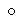

22：方形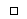

23：不规则方形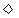

24：三角形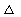

25：倒三角形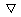

**lty**：设置线的类型（lty%6）

0：无

1：实线

2：虚线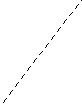

3：点虚线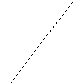

4：点划线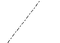

5：长虚线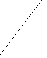

6：长点划线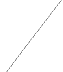

#### 饼图

```R
pie(x, labels = names(x), edges = 200, radius = 0.8,
    clockwise = FALSE, init.angle = if(clockwise) 90 else 0,
    density = NULL, angle = 45, col = NULL, border = NULL,
    lty = NULL, main = NULL, …)
```

**x**: 数值向量，表示每个扇形的面积。

**labels**: 字符型向量，表示各扇形面积标签。

**edges**: 这个参数用处不大，指的是多边形的边数（圆的轮廓类似很多边的多边形）。

**radius**: 饼图的半径。

**main**: 饼图的标题。

**clockwise**: 是一个逻辑值,用来指示饼图各个切片是否按顺时针做出分割。

**init.angle**: 设置开始底纹的角度。

**density**: 底纹的密度。默认值为 NULL。

**col**: 是表示每个扇形的颜色，相当于调色板。

#### 直方图

```R
barplot(H,xlab,ylab,main, names.arg,col,beside)
```

**H** 向量或矩阵，包含图表用的数字值，每个数值表示矩形条的高度

**xlab** x 轴标签

**ylab** y 轴标签

**main** 图表标题

**names.arg** 每个矩形条的名称

**col** 每个矩形条的颜色

**beside**：设置矩形条堆叠的方式，默认为 FALSE，beside=FALSE时，矩形条是水平堆叠的。

beside=TRUE时，矩形条是并列的。

**horizon**：值默认是FALSE，为TRUE的时候表示图形变为水平的

#### 箱线图

boxplot称为箱型图，又叫做盒状图，胡须图。是用来表示数值类型数据分布状况的统计图。它能显示出一组数据的最大值、最小值、中位数、及上下四分位数。

```R
boxplot(x,...)
boxplot(formula, data = NULL, ..., subset, na.action = NULL, drop = FALSE, sep = ".", lex.order = FALSE)
boxplot(x, ..., range = 1.5, width = NULL, varwidth = FALSE,
        notch = FALSE, outline = TRUE, names, plot = TRUE,
        border = par("fg"), col = NULL, log = "",
        pars = list(boxwex = 0.8, staplewex = 0.5, outwex = 0.5),
        horizontal = FALSE, add = FALSE, at = NULL)
#x： 向量，列表或数据框
#formula： 公式，形如y~grp,其中y为向量，grp是数据的分组，通常为因子
#data： 数据框或列表，用于提供公式中的数据
#range： 数值，默认为1.5，表示触须的范围，即range × (Q3 - Q1)
#width： 箱体的相对宽度，当有多个箱体时，有效
#varwidth： 逻辑值，控制箱体的宽度， 只有图中有多个箱体时才发挥作用，默认为FALSE，所有箱体的宽度相同，当其值为TRUE时，代表每个箱体的样本量作为其相对宽度
#notch： 逻辑值，如果该参数设置为TRUE，则在箱体两侧会出现凹口。默认为FALSE
#outline： 逻辑值，如果该参数设置为FALSE，则箱线图中不会绘制离群值。默认为TRUE
#names：绘制在每个箱线图下方的分组标签
#plot ： 逻辑值，是否绘制箱线图，如设置为FALSE，则不绘制箱线图，而给出绘制箱线图的相关信息，如5个点的信息等
#border：箱线图的边框颜色
#col：箱线图的填充色
#horizontal：逻辑值，指定箱线图是否水平绘制，默认为FALSE
```

#### 多图

每一个图形设备都有自己的绘图参数，如果当前还没有打开绘图设备，那么函数*par()*在进行参数设置之前会自动的打开一个新绘图设备。

```R
par(mfrow=c(1, 2), mar = c(4, 4, 1, 1))
#参数分为三类
#1、只能读取，不能进行设置。包括参数cin，cra，csi，cxy，din
#2、只能通过函数par()进行设置。ask，fig，fin，lheight，mai，mar，mex，mfcol，mfrow，new，oma，omi，pin，plt，pty，usr，xlog，ylog
#3、可以通过各种高级绘图函数进行设置，如函数plot，points，lines，abline，text，axis，image，box，contour，rect，arrows等

#cin，以形式（width,height）返回字体大小，单位为英寸
#cra，以形式（width,height）返回字体大小，单位为
#csi，返回默认的字符高度，以英寸为单位
#cxy，以形式(width,height)返回字符宽度、高度，其中cxy=cin/pin
#din，以形式(width,height)返回绘图设备的尺寸规格，单位为英寸

#ask，逻辑值。若为TRUE（且当前的R会话是可交互状态），则在绘制新图像之前会要求用户输入确认信息。同样的，会对扩展包grid和lattice的输出有影响，甚至可能会应用到没有屏幕输出的设备上（但可能会没有效果）。
#fig。一个数值向量，形式为c(x1, x2, y1, y2)，用于设定当前图形在绘图设备中所占区域，注意需要满足x1<x2,y1<y2。如果修改参数fig，会自动打开一个新的绘图设备，而若希望在原来的绘图设备中添加新的图形，需要和参数new=TRUE一起使用。相当于对整个屏幕进行切分
#fin。当前绘图区域的尺寸规格，形式为(width,height)，单位为英寸。如果修改了这个参数的值，默认为启动一个新的绘图设备。
#mfcol、mfrow 行*列，mfcol表示按列排，mfrow表示按行排，不使用该函数默认为1*1
#new。逻辑值，默认值为FALSE。如果设定为TRUE，那么下一个高级绘图命令并不会清空当前绘图设备
#oma。参数形式为c(bottom, left, top, right)，用于设定外边界。
#omi。和参数oma的作用一样，只是这次参数的单位为英寸。
#pin。当前的图像长宽，形式为c(width,height)，单位为英寸。
#plt。形式为c(x1, x2, y1, y2)，设定当前的绘图区域。
#pty。一个字符型参数，表示当前绘图区域的形状，"s"表示生成一个正方形区域，而"m"表示生成最大的绘图区域。
???????????????????????????????????????????????
#usr，形式为c(x1, x2, y1, y2)的向量，表示当前绘图区域的坐标值范围：c(xleft, xright, ybottom, ytop)。如果采用的对数刻度（即xlog=TRUE），那么x坐标轴的表示范围为10^par("usr")[1:2]，同理可以得到y坐标轴的表示范围。
#xlog，逻辑值，TRUE表示对x轴为对数坐标轴，默认值为FALSE
#ylog，逻辑值，TRUE表示对y轴为对数坐标轴，默认值为FALSE
??????????????????????????????????????????????????????

#adj。该参数值用于设定在text、mtext、title中字符串的对齐方向。0表示左对齐，默认值为0.5，表示居中，而1表示右对齐，同时区间[0,1]内的任何值都可以作为参数adj的有效值。在大部分图形设备中，介于区间外的值也是有效的。函数text中的参数adj的值可以以类似于形式adj=c(x,y)调整位置。在text中该参数的值影响的是对点的标记，对函数****mtext和title***来说，参数adj的值影响的是整个图像或设备区域
#ann。如果ann=FALSE，那么高水平绘图函数会调用函数plot.default使对坐标轴名称、整体图像名称不做任何注解。默认值为TRUE。
#bg="white"定义背景为白色。通过函数par()调用时，会同时设定参数new=FALSE。
#bty，字符串型，用于限定图形的边框类型。"o"（默认值）、"l"、"7"、"c"、"u"或者"]"中的任意一个，对应的边框类型就和该字母的形状相似。值为"n"时表示无边框。
#cex。用于表示对默认的绘图文本和符号放大多少倍。需要注意一些绘图函数如plot.default等也有一个相同名字的参数，但是此时表示在函数par()的参数cex的基础上再放大多少倍，此外还有函数points等接受一个数值向量为参数。
#cex.axis。表示在当前的cex设定情况下，对坐标轴刻度值字体的放大倍数。
#cex.lab。表示在当前的cex设定情况下，对坐标轴名称字体的放大倍数。
#cex.main。表示在当前的cex设定情况下，对主标题字体的放大倍数。
#cex.sub。表示在当前的cex设定情况下，对子标题字体的放大倍数。
#col，用于设定默认的绘图颜色。
#col.axis。坐标轴刻度值的颜色，默认为"black"
#col.lab。坐标轴名称的颜色，默认为"black"。
#col.sub。子标题的颜色，默认为"black"。
#family。图形中字符的字体类型。最大的长度为200 bytes。默认值为""，表示采用绘图设备的默认字体。
#fg。图形中显著位置的颜色（如坐标轴、刻度线，边框等），一般默认为"black"。
#font，设定采用的字型，整数。1代表纯文本（默认值），2表示黑体，3表示斜体，4表示黑色斜体。在Adobe字符编码下，5也可以。font.axis坐标轴刻度值的字型；font.lab坐标轴名称的字型；font.main主标题的字型；font.sub子标题的字型。
#lab，以形式c(x,y,len)表示的数值型向量，用于对坐标轴的名称进行设定。值x和y用于设定x和y轴上的刻度线的个数，而len设定了刻度线的长度（目前R中这个值是没有效应的）。
#las，只能是0,1,2,3中的某一个值，用于表示刻度值的方向。0表示总是平行于坐标轴；1表示总是水平方向；2表示总是垂直于坐标轴；3表示总是垂直方向。
#lend，线段的端点样式，参数值可以为一个整数或者一个字符串。参数值为0或者"round"时，表示端点样式为圆角（默认值）；为1或者"butt"时，表示端点直接截断；为2或者"square"表示延伸末端。
#lty，直线类型
#lwd，线条宽度
#mgp，设定标题、坐标轴名称、坐标轴距图形边框的距离。默认值为c(3,1,0)，其中第一个值影响的是标题
#pch，表示点的形状
#srt，字符串旋转度数，只支持函数text。
#tck，刻度线的长度，若为一个小于等于0.5的小数，表示绘图区域的高度或宽度的比例（取高度或宽度中较小的值）。如果tck=1，则表示绘制网格线。默认值为NA（相当于tcl=-0.5）。
#tcl，可用于设定刻度线的长度，但是和tck的单位不同，默认值为-0.5。
？？？？？
#xaxp，形式为c(x1, x2, n)的向量，表示当xlog=false时，x坐标轴的刻度线的区间及区间中的刻度线个数。xlog=TRUE时，情形稍微复杂一些：若取值范围较小，那么n是一个负数，且刻度线的分布和正常情形（没有对数转换）下相似；若n取值为1、2、3中的一个，c(x1,x2)=10^par("usr")[1:2]（并且此时par("usr")是指par("xlog")=TRUE情况下返回的值）。
#具体解释如下：
#n=1，在坐标值为10^j（j为整数）处绘制刻度线。
#n=2，在坐标值为k*(10^j)处绘制刻度线，其中k为1或者5。
#n=3，在坐标值为k*(10^j)处绘制刻度线，其中k为1、2或者5。
#yaxp与xaxp相同，表示y坐标轴的刻度线的区间及区间中的刻度线个数。
？？？？？
#xaxs，坐标轴x的间隔设定方式，一个字符，取值范围为："r","i","e","s","d"。计算方式是由xlim的数值范围确定。"r"(regular)首先会对数值范围向两端各延伸4%，然后在延伸后的数值区间中设置坐标值；"i"(internal)直接在原始的数据范围中设置坐标值；"s"(standard)、"e"(extended)、"d"(direct)目前不支持。
#yaxs，坐标轴y的间隔设定方式，一个字符，取值范围为："r","i","e","s","d"。计算方式是由xlim的数值范围确定。"r"(regular)首先会对数值范围向两端各延伸4%，然后在延伸后的数值区间中设置坐标值；"i"(internal)直接在原始的数据范围中设置坐标值；"s"(standard)、"e"(extended)、"d"(direct)目前不支持。
#xaxt，设定x坐标轴的刻度值类型，为一个字符。"n"表示不绘制刻度值及刻度线，默认值为"s"，表示绘制
#yaxt，设定y坐标轴的刻度值类型，为一个字符。"n"表示不绘制刻度值及刻度线，默认值为"s"，表示绘制

#还原为系统默认值
#1、调用par()函数设置图形参数之前先执行opar = par(no.readonly=TURE)保存系统当前的环境，待需要还原时执行par(opar)
#2、关闭图形对话框，重新打开
```

#### 散点图矩阵

```R
#构造散点图矩阵，观察出变量两两之间的关系
pairs(x, labels, panel = points, ...,
          lower.panel = panel, upper.panel = panel,
          diag.panel = NULL, text.panel = textPanel,
          label.pos = 0.5 + has.diag/3, line.main = 3,
          cex.labels = NULL, font.labels = 1,
          row1attop = TRUE, gap = 1, log = "")
#一般使用pairs(~wt+mpg+disp+cyl,data = mtcars, main = "Scatterplot Matrix",panel = panel.smooth,upper.panel = NULL)

```

#### 优化函数

```R
#更改坐标轴
axis(side,at = NULL, labels = TRUE, tick = TRUE, line = NA,
     pos= NA, outer = FALSE, font = NA, lty = "solid",
     lwd = 1, lwd.ticks = lwd, col = NULL,col.ticks = NULL,
     hadj = NA, padj = NA, ...)
#side，表示在图形的哪边绘制坐标轴（1=下，2=左，3=上，4=右）
#at，一个数值向量，表示需要绘制刻度线的位置
#pos，1表示下方，2表示左方，3表示上方，4表示右方
#line,调整坐标轴的高度
#labels：一个字符型向量(也可以是数值型)，表示刻度线旁边的文字标签(刻度值)，如果整个不写，则直接使用at的值
#col：线条和刻度的颜色
#lty：线条类型
#las：标签的字体是否平行(=0)或者垂直(=2)坐标轴
#tck：刻度线的长度(默认值-0.01，负值表示刻度在图形外，正值表示刻度在图形内侧)

#更改标题
title(main= NULL, sub = NULL, xlab = NULL, ylab = NULL,
      line = NA, outer = FALSE, ...)

#添加注释
text(x, y = NULL, labels = seq_along(x$x), adj = NULL,
     pos = NULL, offset = 0.5, vfont = NULL,
     cex = 1, col = NULL, font = NULL, ...)
#adj的值可以以类似于形式adj=c(x,y)调整方向

#添加直线
abline(a = NULL, b = NULL, h = NULL, v = NULL, reg = NULL, coef = NULL, untf = FALSE, ...)
#a 要绘制的直线截距
#b 直线的斜率
#h 绘制水平线时的纵轴值
#v 绘制垂直线时的横轴值
#reg 是一个具有coef方法的回归对象名称。若该对象返回的向量长度为1，则该值会作为该该函数的斜率，否则前两个值将会分别作为所绘直线的截距和斜率。
#coef 一个二维向量，给出截距和斜率
#untf 逻辑值，如果UNTF为真，且坐标轴中的一个或两个进行了对数变换，则会绘制对应于原始坐标系中的直线的曲线，否则在变换坐标系中绘制线。

#添加箭头
arrows(x0, y0, x1 = x0, y1 = y0, length = 0.25, angle = 30, 
  code = 2, col = par("fg"), lty = par("lty"), lwd = par("lwd"), 
  ...)

#添加线段
segments(x0, y0, x1 = x0, y1 = y0, col = par("fg"), lty = par("lty"), 
  lwd = par("lwd"), ...)

#添加图例
legend(x, y = NULL, legend, fill = NULL, col = par("col"), 
  border = "black", lty, lwd, pch, angle = 45, density = NULL, 
  bty = "o", bg = par("bg"), box.lwd = par("lwd"), box.lty = par("lty"), 
  box.col = par("fg"), pt.bg = NA, cex = 1, pt.cex = cex, 
  pt.lwd = lwd, xjust = 0, yjust = 1, x.intersp = 1, y.intersp = 1, 
  adj = c(0, 0.5), text.width = NULL, text.col = par("col"), 
  text.font = NULL, merge = do.lines && has.pch, trace = FALSE, 
  plot = TRUE, ncol = 1, horiz = FALSE, title = NULL, inset = 0, 
  xpd, title.col = text.col, title.adj = 0.5, seg.len = 2)

#函数图
curve(expr, from = NULL, to = NULL, n = 101, add = FALSE,
      type = "l", xname = "x", xlab = xname, ylab = NULL,
      log = NULL, xlim = NULL, …)
#expr：函数表达式，关于x的表达式，形式为：x*2+1
#from和to：绘图的起止范围
#n：一个整数值，表示 x 取值的数量
#add：是一个逻辑值，当为 TRUE 时，表示将绘图添加到已存在的绘图中
#type：绘图的类型，与plot函数一致
#xnam：用于 x 轴变量的名称
#xlim 和ylim：表示x轴和y轴的范围
#xlab，ylab：x 轴和 y 轴的标签名称

#切割画布
clip(x1, x2, y1, y2)

#画直方图
hist()

#低级绘图函数，在图上添加标记
symbols(x, y = NULL, circles, squares, rectangles, stars, 
  thermometers, boxplots, inches = TRUE, add = FALSE, fg = par("col"), 
  bg = NA, xlab = NULL, ylab = NULL, main = NULL, xlim = NULL, 
  ylim = NULL, ...)
#circles, squares, rectangles, stars, thermometers, boxplots
#inches参数选择1，圆环的半径将是1英寸，如果inches=2，则为2英寸。一般设置inches=FALSE

#调色板
palette

#彩虹色
rainbow

#设置透明度，取值0-1，0表示完全透明，1表示完全不透明
SetAlpha
```

#### 字体

```R
install.packages("showtext", repos = "https://mirrors.ustc.edu.cn/CRAN/")  # 安装 showtext
font_files()   # 查看字体
```

##### 一些例子

```R
plot(cars$dist~cars$speed, #y~x，cars是R自带的数据
     main="Relationship between car distance & speed", #标题
     xlab = "Speed(miles per hour)", #x轴标题
     ylab = "Distance travelled (miles)", #Y轴标题
     xlim = c(0,30), #设置x轴的取值区间
     ylim = c(0,140), #设置y轴的取值区间
     xaxs = "i", #这里是设置x轴的风格
     yaxs = "i", #这里是设置y轴的风格
     col = "red", #设置颜色
     pch = 19) #pch指代点的形状，用数字表示，19表示实心圆角菱形
```

##### 实现loading图

```R

```

### 2 其他画图库

#### ggplot2

```R
install.packages("ggplot2", repos = "https://mirrors.ustc.edu.cn/CRAN/")
library(ggplot2)
name <- c("多","中","少","中","少")
data1 <- data.frame(name) #转化为数据框
ggplot(data1,aes(x=name)) + geom_bar()
#直方图
geom_bar
#散点图
geom_point
#
geom_histogram
#箱线图
geom_boxplot
#x轴标签
xlab
#y轴标签
ylab
#x轴取值范围
xlim
#y轴取值范围
ylim
labs
#标题
ggtitle
#theme,可以使用语言自带，也可以自定义
theme_bw()
#y轴标尺
scale_y_continuous
#保存
ggsave
```

##### ggplot2基本要素

- 数据（Data）和映射（Mapping）mapping = aes

- 几何对象（Geometric）geom_xxx

- 标尺（Scale）scale_ 属性 _

- 统计变换（Statistics）stat_

- 坐标系统（Coordinante）coord_

- 图层（Layer）

- 分面（Facet）facet_

- 主题（Theme）theme_

  ```
  geom_abline 	geom_area 	
  geom_bar 		geom_bin2d
  geom_blank 		geom_boxplot 	
  geom_contour 	geom_crossbar
  geom_density 	geom_density2d 	
  geom_dotplot 	geom_errorbar
  geom_errorbarh 	geom_freqpoly 	
  geom_hex 		geom_histogram
  geom_hline 		geom_jitter 	
  geom_line 		geom_linerange
  geom_map 		geom_path 	
  geom_point 		geom_pointrange
  geom_polygon 	geom_quantile 	
  geom_raster 	geom_rect
  geom_ribbon 	geom_rug 	
  geom_segment 	geom_smooth
  geom_step 		geom_text 	
  geom_tile 		geom_violin
  geom_vline
  ```

  ```
  stat_abline       stat_contour      stat_identity     stat_summary
  stat_bin          stat_density      stat_qq           stat_summary2d
  stat_bin2d        stat_density2d    stat_quantile     stat_summary_hex
  stat_bindot       stat_ecdf         stat_smooth       stat_unique
  stat_binhex       stat_function     stat_spoke        stat_vline
  stat_boxplot      stat_hline        stat_sum          stat_ydensity
  ```

  ```
  coord_equal
  ```

  ```
  facet_wrap	facet_grid
  ```

  ```
  theme_economist theme_economist_white
  theme_wsj 	 	theme_excel
  theme_few 	 	theme_foundation
  theme_igray 	theme_solarized
  theme_stata 	theme_tufte
  ```

#### ggpubr

```R
install.packages("ggpubr", repos = "https://mirrors.ustc.edu.cn/CRAN/")

```

#### scatterplot3d

#### factoextra

#### DescTools

```R
PlotBubble()
```

# R语言进阶

## 一、高级常用函数

### 1 数据操作函数

#### aggregate函数

可以按照要求把数据打组聚合，类似于apply函数

### 2 其他函数

#### 

## 二、其他R语言包

### 1 管道操作相关包magrittr

#### magrittr介绍

magrittr是一个实现管道操作的辅助包，可以帮助R语言实现更简单的数据操作

```R
install.packages('magrittr')

library(magrittr)
```

#### 使用方法

##### %>% 向右操作符

左侧准备的数据或表达式，传递给右侧的函数调用或表达式进行运算，可以连续操作。

```R
rnorm(10000) %>%
abs %>% `*` (50)  %>%
matrix(ncol=100)  %>%
rowMeans %>% round %>% 
`%%`(7) %>% hist
```

##### %T>% 向左操作符

功能和**%>%**基本一样，不过是下一次传递时把符号左边的值做为传递的值，而不是右边的值。

```R
#输出直方图后，返回值为空，如果再继续管道，就会把空值向右进行传递
rnorm(10000) %>%
abs %>% `*` (50)  %>%
matrix(ncol=100)  %>%
rowMeans %>% round %>% 
`%%`(7) %T>% hist %>% sum
```

##### %$% 解释操作符

**%$%**的作用是把左侧数据的属性名传给右侧，让右侧的调用函数直接通过名字，就可以获取左侧的数据，而不必用到变量名。

```R
set.seed(1)
data.frame(x=1:10,y=rnorm(10),z=letters[1:10]) %$% .[which(x>5),]
#等价于
df<-data.frame(x=1:10,y=rnorm(10),z=letters[1:10])
df[which(df$x>5),]
```

##### %<>% 复合赋值操作符

功能与 %>% 基本是一样的，但是会把结果写回左侧对象。需要注意的是**%<>%**必须要用在第一个管道的对象处，才能完成赋值的操作。

```R
set.seed(1)
x<-rnorm(100) %<>% abs %>% sort %>% head(10)
```

#### 扩展功能

##### 符号操作符定义

```R
#对于每个操作符都有对应的函数
extract	                  `[`
extract2	          `[[`
inset	                  `[<-`
inset2	                  `[[<-`
use_series	          `$`
add	                  `+`
subtract	          `-`
multiply_by	          `*`
raise_to_power	          `^`
multiply_by_matrix	  `%*%`
divide_by	          `/`
divide_by_int	          `%/%`
mod	                  `%%`
is_in	                  `%in%`
and	                  `&`
or	                  `|`
equals	                  `==`
is_greater_than	          `>`
is_weakly_greater_than	  `>=`
is_less_than	          `<`
is_weakly_less_than	  `<=`
not (`n'est pas`)	  `!`
set_colnames	          `colnames<-`
set_rownames	          `rownames<-`
set_names	          `names<-`
```

##### %>%传递到代码块

对同一个数据块进行多个操作处理后再进行传递，需要一个代码块进行处理。把数据集传递到{}代码块中，传入的数据集以   **.**  来表示，通过一段代码来完成操作。

```R
#示例
set.seed(1)
rnorm(10)    %>%
multiply_by(5) %>%
add(5)         %>%
{ 
  cat("Mean:", mean(.), 
     "Var:", var(.), "\n")
  sort(.) %>% head
}
```

##### %>%传递到函数

传递到函数和传递到代码块设计是类似的，是把一个数据集传给一个匿名函数，进行复杂的数据操作。显式地定义数据集的名字作为匿名函数的参数。

```R
#示例
iris %>%
(function(x) {
  if (nrow(x) > 2) 
    rbind(head(x, 1), tail(x, 1))
  else x
})
```

### 2 RColorBrewer颜色扩展包